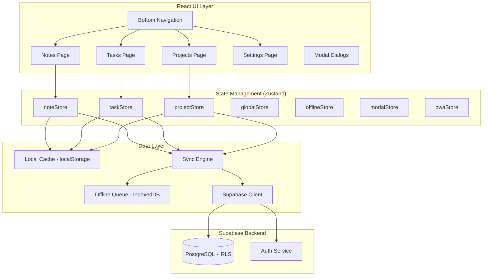
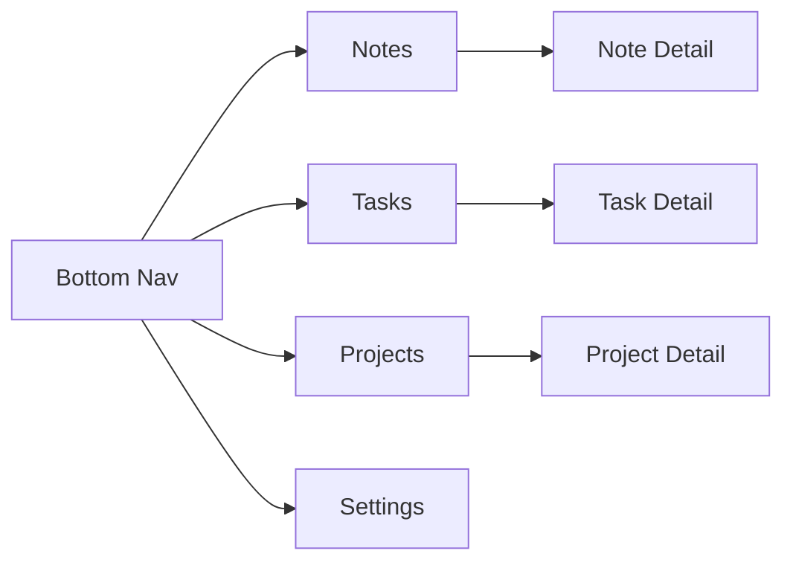
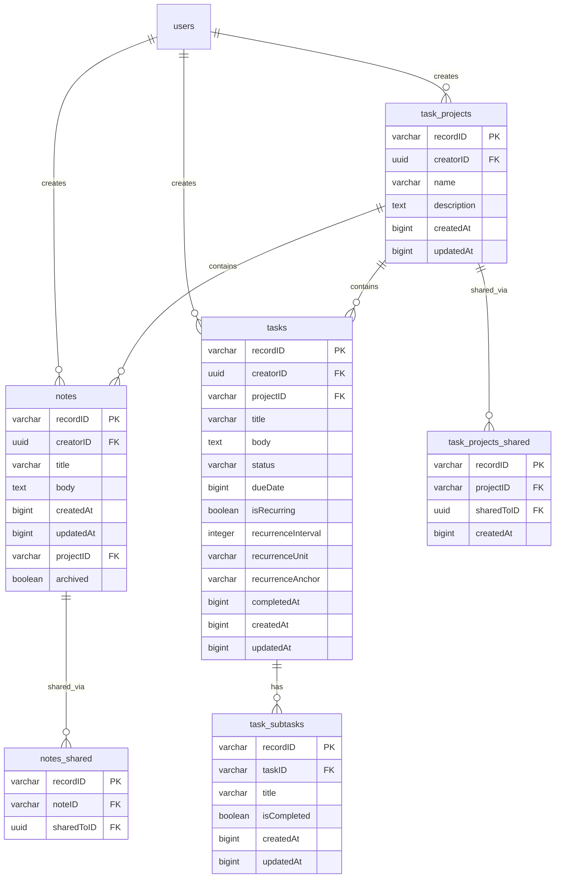

# Design Document: simpleTracker Notes & Tasks

## Overview

This design describes the conversion of simpleBudget into simpleTracker — a notes and task tracking application. The conversion replaces all budget-specific UI, state management, and data access with a new system supporting markdown notes, tasks with recurrence, subtasks, projects, and differentiated offline/online caching based on sharing status.

The architecture retains the existing Supabase backend, authentication system, PWA infrastructure, and deployment pipeline. Changes are scoped to:
- New Zustand stores replacing `tableStore` and `modalStore`
- A generalized offline queue and sync engine (replacing the transaction-specific implementation)
- New page components for Notes, Tasks, Projects
- A markdown rendering pipeline
- Recurring task generation logic
- A sharing-aware caching strategy

## Architecture



### Key Architectural Decisions

1. **Three domain stores** (`noteStore`, `taskStore`, `projectStore`) replace the single `tableStore`. Each store owns its entity's CRUD operations, caching, and state.

2. **Generalized offline queue**: The existing `offlineQueue.ts` is refactored from a `PendingTransaction`-specific store to a generic `PendingMutation` store that handles inserts, updates, and deletes across all entity types.

3. **Markdown rendering via `react-markdown`**: Chosen for its native React component model (renders to virtual DOM, not `dangerouslySetInnerHTML`), plugin ecosystem (remark-gfm for tables/strikethrough), and active maintenance. Lightweight alternative `markdown-to-jsx` was considered but lacks the plugin extensibility needed for future features.

4. **Sharing-aware caching**: Non-shared items use localStorage cache + IndexedDB offline queue for offline-first behavior. Shared items are always fetched from the server and never cached locally, avoiding stale data and merge conflicts.

5. **Recurrence generation is client-side**: When a recurring task is completed, the client generates the next occurrence immediately. This keeps the logic simple and avoids server-side cron jobs, at the cost of requiring the completing client to be online (acceptable since completion triggers a server write anyway).

## Components and Interfaces

### Zustand Stores

#### `noteStore`

```typescript
interface Note {
  recordID: string;
  creatorID: string;
  title: string;
  body: string;
  createdAt: number;
  updatedAt: number;
  projectID: string | null;
  archived: boolean;
}

interface NoteShared {
  recordID: string;
  noteID: string;
  sharedToID: string;
}

interface NoteStore {
  notes: Note[];
  archivedNotes: Note[];
  sharedNotes: Note[];
  loading: boolean;
  error: string | null;

  fetchNotes: () => Promise<void>;
  fetchArchivedNotes: () => Promise<void>;
  createNote: () => Promise<Note | null>;
  updateNote: (id: string, fields: Partial<Pick<Note, 'title' | 'body' | 'projectID'>>) => Promise<boolean>;
  archiveNote: (id: string) => Promise<boolean>;
  unarchiveNote: (id: string) => Promise<boolean>;
  deleteNote: (id: string) => Promise<boolean>;
  shareNote: (noteID: string, email: string) => Promise<boolean>;
  unshareNote: (noteID: string, sharedToID: string) => Promise<boolean>;
  getSharesForNote: (noteID: string) => Promise<NoteShared[]>;
}
```

#### `taskStore`

```typescript
interface Task {
  recordID: string;
  creatorID: string;
  projectID: string | null;
  title: string;
  body: string;
  status: 'open' | 'completed';
  dueDate: number | null;
  isRecurring: boolean;
  recurrenceInterval: number | null;
  recurrenceUnit: 'days' | 'weeks' | 'months' | null;
  recurrenceAnchor: 'due_date' | 'completed_date';
  completedAt: number | null;
  createdAt: number;
  updatedAt: number;
}

interface Subtask {
  recordID: string;
  taskID: string;
  title: string;
  isCompleted: boolean;
  createdAt: number;
  updatedAt: number;
}

interface TaskStore {
  tasks: Task[];
  subtasks: Record<string, Subtask[]>; // keyed by taskID
  statusFilter: 'open' | 'completed' | 'all';
  loading: boolean;
  error: string | null;

  setStatusFilter: (filter: 'open' | 'completed' | 'all') => void;
  fetchTasks: () => Promise<void>;
  createTask: (title: string) => Promise<Task | null>;
  updateTask: (id: string, fields: Partial<Pick<Task, 'title' | 'body' | 'dueDate' | 'projectID' | 'isRecurring' | 'recurrenceInterval' | 'recurrenceUnit' | 'recurrenceAnchor'>>) => Promise<boolean>;
  completeTask: (id: string) => Promise<boolean>;
  reopenTask: (id: string) => Promise<boolean>;
  deleteTask: (id: string) => Promise<boolean>;

  fetchSubtasks: (taskID: string) => Promise<void>;
  addSubtask: (taskID: string, title: string) => Promise<Subtask | null>;
  toggleSubtask: (subtaskID: string) => Promise<boolean>;
  deleteSubtask: (subtaskID: string) => Promise<boolean>;
}
```

#### `projectStore`

```typescript
interface Project {
  recordID: string;
  creatorID: string;
  name: string;
  description: string;
  createdAt: number;
  updatedAt: number;
}

interface ProjectShared {
  recordID: string;
  projectID: string;
  sharedToID: string;
  createdAt: number;
}

interface ProjectStore {
  projects: Project[];
  loading: boolean;
  error: string | null;

  fetchProjects: () => Promise<void>;
  createProject: (name: string, description?: string) => Promise<Project | null>;
  updateProject: (id: string, fields: Partial<Pick<Project, 'name' | 'description'>>) => Promise<boolean>;
  deleteProject: (id: string) => Promise<boolean>;
  shareProject: (projectID: string, email: string) => Promise<boolean>;
  unshareProject: (projectID: string, sharedToID: string) => Promise<boolean>;
  getSharesForProject: (projectID: string) => Promise<ProjectShared[]>;
}
```

### Generalized Offline Queue

```typescript
interface PendingMutation {
  id: string;              // unique queue entry ID
  entityType: 'note' | 'task' | 'subtask' | 'project';
  operation: 'insert' | 'update' | 'delete';
  recordID: string;        // the entity's recordID
  payload: Record<string, unknown>;  // the data to write
  _queuedAt: number;      // timestamp when queued
}

interface OfflineQueue {
  enqueue: (mutation: PendingMutation) => Promise<void>;
  dequeue: (id: string) => Promise<void>;
  getAll: () => Promise<PendingMutation[]>;
  pendingCount: () => Promise<number>;
  removeByRecordID: (recordID: string) => Promise<void>;
}
```

### Sync Engine

The sync engine is generalized to handle any entity type:

```typescript
interface SyncEngine {
  initOfflineSync: () => () => void;  // returns cleanup function
  syncPendingMutations: () => Promise<{ synced: number; failed: number }>;
  verifyConnectivity: () => Promise<boolean>;
  insertWithOfflineSupport: (entityType: string, table: string, payload: Record<string, unknown>) => Promise<{ success: boolean; queued: boolean }>;
  updateWithOfflineSupport: (entityType: string, table: string, recordID: string, payload: Record<string, unknown>) => Promise<{ success: boolean; queued: boolean }>;
  deleteWithOfflineSupport: (entityType: string, table: string, recordID: string) => Promise<{ success: boolean; queued: boolean }>;
}
```

### Sharing Utility

```typescript
interface SharingUtils {
  isSharedItem: (item: Note | Task, currentUserID: string, projectShares: ProjectShared[]) => boolean;
  lookupUserByEmail: (email: string) => Promise<{ recordID: string } | null>;
}
```

### Recurrence Calculator

```typescript
interface RecurrenceCalculator {
  calculateNextDueDate: (
    anchor: 'due_date' | 'completed_date',
    originalDueDate: number | null,
    completedAt: number,
    interval: number,
    unit: 'days' | 'weeks' | 'months'
  ) => number;

  spawnRecurringTask: (completedTask: Task, subtasks: Subtask[]) => { task: Omit<Task, 'recordID' | 'createdAt' | 'updatedAt'>; subtasks: Omit<Subtask, 'recordID' | 'taskID' | 'createdAt' | 'updatedAt'>[] };
}
```

### Page Components

| Component | Route | Description |
|-----------|-------|-------------|
| `NotesPage` | `/notes` | List of notes with create FAB, archive toggle |
| `NoteDetailPage` | `/notes/:id` | Markdown editor/viewer for a single note |
| `TasksPage` | `/tasks` | Task list with status filter, create FAB |
| `TaskDetailPage` | `/tasks/:id` | Task editor with subtask checklist |
| `ProjectsPage` | `/projects` | Project list with create option |
| `ProjectDetailPage` | `/projects/:id` | Project view showing contained notes/tasks |
| `SettingsPage` | `/settings` | Theme toggle, account, Supabase config |

### Navigation Structure



## Data Models

### Database Schema (from migrations)



### Local Cache Structure (localStorage)

| Key | Content | Eviction |
|-----|---------|----------|
| `cachedNotes` | JSON array of non-shared Note objects | LRU by updatedAt when > 50MB total |
| `cachedTasks` | JSON array of non-shared Task objects | LRU by updatedAt when > 50MB total |
| `cachedSubtasks` | JSON map of taskID → Subtask[] | Evicted with parent task |
| `cachedProjects` | JSON array of non-shared Project objects | LRU by updatedAt when > 50MB total |

### Sharing Detection Logic

An item is considered "shared" if any of these conditions are true:
- The item has a direct share record (notes_shared or task_projects_shared)
- The item belongs to a project that has share records
- The item's creatorID differs from the current user (i.e., the user sees it via sharing)

## Correctness Properties

*A property is a characteristic or behavior that should hold true across all valid executions of a system — essentially, a formal statement about what the system should do. Properties serve as the bridge between human-readable specifications and machine-verifiable correctness guarantees.*

### Property 1: Supabase Config Resolution Priority

*For any* combination of config sources (window.__SUPABASE_CONFIG__, localStorage supabaseCustomConfig, VITE env vars, hardcoded defaults), the resolved config SHALL always be the highest-priority non-empty source, where priority is: window config > localStorage > env vars > defaults.

**Validates: Requirements 2.4**

### Property 2: Input Length Validation

*For any* string input used as a note title, task title, subtask title, or project name, the system SHALL accept the input if and only if its trimmed length is between 1 and the entity's maximum (255 for titles, 100 for project names), and SHALL reject it otherwise without modifying any stored data.

**Validates: Requirements 4.2, 4.6, 8.2, 11.2, 13.2**

### Property 3: Note Creation Defaults

*For any* authenticated user, creating a new note SHALL produce a record with a non-empty recordID, creatorID equal to the user's ID, empty title, empty body, archived=false, projectID=null, and createdAt equal to updatedAt.

**Validates: Requirements 4.1**

### Property 4: Task Creation Defaults

*For any* valid title (1-255 characters) and authenticated user, creating a new task SHALL produce a record with a non-empty recordID, creatorID equal to the user's ID, the provided title, body="", status="open", dueDate=null, isRecurring=false, completedAt=null, and createdAt equal to updatedAt.

**Validates: Requirements 8.1**

### Property 5: List Ordering

*For any* collection of notes, the default notes list SHALL contain only non-archived notes ordered by updatedAt descending; the archived notes list SHALL contain only archived notes ordered by updatedAt descending; the projects list SHALL be ordered by updatedAt descending; and subtasks within a task SHALL be ordered by createdAt ascending.

**Validates: Requirements 5.1, 5.3, 5.4, 11.6, 13.7**

### Property 6: Archive Round-Trip

*For any* non-archived note, archiving it SHALL set archived=true with updatedAt >= the previous updatedAt, and subsequently unarchiving it SHALL set archived=false with updatedAt >= the archive updatedAt. The note's title and body SHALL remain unchanged through both operations.

**Validates: Requirements 5.2, 5.5**

### Property 7: Creator-Only Permissions

*For any* user and any entity (note, task, project), the delete option, sharing management controls, and (for projects) edit controls SHALL be available if and only if the user's ID equals the entity's creatorID.

**Validates: Requirements 6.4, 7.4, 11.5, 12.4, 13.6, 14.5**

### Property 8: Task Status Round-Trip

*For any* open task, marking it complete SHALL set status="completed" and completedAt to a non-null timestamp with updatedAt updated. Subsequently reopening it SHALL set status="open", completedAt=null, and updatedAt updated. The task's title, body, and projectID SHALL remain unchanged through both operations.

**Validates: Requirements 9.1, 9.2**

### Property 9: Recurring Task Date Calculation

*For any* recurring task with a valid recurrenceInterval (1-365), recurrenceUnit ("days"|"weeks"|"months"), and recurrenceAnchor, completing the task SHALL produce a new task whose dueDate equals: if anchor is "due_date" and originalDueDate is set, addDuration(originalDueDate, interval, unit); if anchor is "due_date" and originalDueDate is null, addDuration(completedAt, interval, unit); if anchor is "completed_date", addDuration(completedAt, interval, unit).

**Validates: Requirements 10.3, 10.4, 10.6**

### Property 10: Recurring Task Field Copying

*For any* completed recurring task with arbitrary title, body, projectID, recurrence settings, and subtask titles, the spawned task SHALL have status="open", completedAt=null, and identical values for title, body, projectID, isRecurring, recurrenceInterval, recurrenceUnit, recurrenceAnchor, and the same set of subtask titles (each with isCompleted=false).

**Validates: Requirements 10.5**

### Property 11: Subtask Toggle Involution

*For any* subtask, toggling its isCompleted state SHALL invert the boolean value and update updatedAt. Toggling it twice SHALL restore the original isCompleted value.

**Validates: Requirements 11.3**

### Property 12: Mutations Update Timestamp

*For any* successful update operation on a note, task, subtask, or project, the entity's updatedAt field SHALL be set to a value greater than or equal to its previous updatedAt value.

**Validates: Requirements 4.2, 8.3, 13.3**

### Property 13: Offline Queue FIFO Order

*For any* sequence of mutations enqueued with monotonically increasing _queuedAt timestamps, the sync engine SHALL process them in ascending _queuedAt order (oldest first).

**Validates: Requirements 15.2**

### Property 14: Shared Items Excluded from Offline Cache

*For any* item that is determined to be shared (via direct sharing or project membership), the item SHALL NOT be present in localStorage cache or the IndexedDB offline queue. When a non-shared item becomes shared, it SHALL be removed from all local storage.

**Validates: Requirements 16.2, 16.6**

### Property 15: Shared Project Permission Model

*For any* user who has access to a project via task_projects_shared, and any note or task within that project, the user SHALL have read and edit access but SHALL NOT have delete permission on items they did not create.

**Validates: Requirements 14.2**

### Property 16: Cache LRU Eviction

*For any* set of cached non-shared items whose total size exceeds the 50MB storage limit, the eviction process SHALL remove items in ascending order of updatedAt (least recently updated first) until the total size is within the limit.

**Validates: Requirements 15.6**

### Property 17: Offline Queue Stores Mutations with Timestamp

*For any* mutation enqueued while offline, the queue entry SHALL contain the complete mutation payload and a _queuedAt timestamp equal to the time of enqueueing.

**Validates: Requirements 15.1**

## Error Handling

### Network Errors

| Scenario | Behavior |
|----------|----------|
| Non-shared item CRUD while offline | Enqueue mutation, update local state optimistically, sync when online |
| Shared item read while offline | Display "Shared items require internet connection" message, prevent interaction |
| Shared item write failure | Retain user input in editor, display error snackbar, do not update local state |
| Sync conflict (duplicate key) | Remove from queue, treat server as authoritative, show notification |
| Sync failure (non-conflict) | Retain in queue, retry on next sync cycle |

### Validation Errors

| Scenario | Behavior |
|----------|----------|
| Title/name too long or empty | Prevent submission, display inline validation message |
| Note body exceeds 100,000 chars | Prevent input beyond limit |
| Subtask count exceeds 50 | Prevent addition, display limit message |
| Share to non-existent user | Display "User not found" error |
| Duplicate share | Display "Already shared" message |
| Self-share attempt | Display "Cannot share with yourself" error |

### State Recovery

- On app startup, load non-shared items from localStorage cache for instant render
- Ignore/clear any legacy budget cache keys (`cachedBudgets`, `cachedSections`, `cachedCategories`, `cachedTransactions`)
- If localStorage is corrupted, fall back to empty state and fetch from server
- If IndexedDB is unavailable, fall back to online-only mode (no offline queue)

## Testing Strategy

### Property-Based Testing

**Library**: [fast-check](https://github.com/dubzzz/fast-check) (TypeScript-native, integrates with vitest)

**Configuration**: Minimum 100 iterations per property test.

**Tag format**: `Feature: simpletracker-notes-tasks, Property {number}: {property_text}`

Property-based tests will cover:
- Input validation logic (Property 2)
- Entity creation defaults (Properties 3, 4)
- List ordering/filtering (Property 5)
- Archive round-trip (Property 6)
- Permission checks (Property 7)
- Status transitions (Property 8)
- Recurrence date calculation (Property 9)
- Recurrence field copying (Property 10)
- Subtask toggle involution (Property 11)
- Timestamp updates (Property 12)
- Queue ordering (Property 13)
- Cache exclusion (Property 14)
- Permission model (Property 15)
- LRU eviction (Property 16)
- Queue storage (Property 17)

### Unit Testing (Example-Based)

Unit tests will cover:
- Markdown rendering output for specific syntax elements
- Navigation routing and redirect behavior
- Auth flow error handling
- Confirmation dialog behavior (delete prompts)
- Sharing error cases (user not found, duplicate, self-share)
- Offline indicator display logic
- PWA update prompt behavior

### Integration Testing

Integration tests will cover:
- Supabase RLS policy enforcement (verify creator-only delete, shared access)
- End-to-end sync cycle (enqueue → go online → verify server state)
- Project deletion cascade (projectID nullification on contained items)
- Auth session persistence across page reloads

### Test Organization

```
src/
├── lib/
│   ├── __tests__/
│   │   ├── offlineQueue.test.ts        # Property tests for queue
│   │   ├── offlineSync.test.ts         # Unit tests for sync engine
│   │   ├── recurrence.test.ts          # Property tests for date calc
│   │   ├── recurrence.property.test.ts # PBT for Properties 9, 10
│   │   ├── validation.test.ts          # Property tests for input validation
│   │   └── cache.test.ts              # Property tests for LRU eviction
│   └── ...
├── store/
│   ├── __tests__/
│   │   ├── noteStore.test.ts          # Property + unit tests
│   │   ├── taskStore.test.ts          # Property + unit tests
│   │   └── projectStore.test.ts       # Property + unit tests
│   └── ...
└── components/
    └── __tests__/
        ├── NotesPage.test.tsx         # Unit tests for UI behavior
        ├── TasksPage.test.tsx         # Unit tests for UI behavior
        └── ...
```
