<p align="center">
  
</p>

<h1 align="center">simpleTracker</h1>

<p align="center">
  A simple, open-source productivity app for managing notes, tasks, and projects. Installable as a PWA with full offline support.
</p>

<p align="center">
  <a href="https://github.com/simplesuite/simpletracker/blob/main/LICENSE"></a>
  <a href="https://github.com/simplesuite/simpletracker/stargazers"></a>
  <a href="https://github.com/simplesuite/simpletracker/issues"></a>
  <a href="https://supabase.com"></a>
</p>

---

## What is simpleTracker?

simpleTracker is a free, open-source alternative to Todoist, KeepNote, DoneTick, and Apple Notes for personal productivity. It's a mobile-first progressive web app (PWA) you can install on iOS, Android, or desktop — or self-host with your own Supabase backend.

Built for people who want a straightforward way to manage notes, tasks, and projects without subscriptions or ads.

## Features

- **Markdown notes** — Full Markdown support with live preview and formatting toolbar
- **Checklists** — List-type notes with completable items
- **Task management** — Tasks with subtasks, due dates, and completion tracking
- **Recurring tasks** — Configurable recurrence (daily, weekly, monthly) anchored to due date or completion
- **Projects** — Group related notes and tasks together
- **Sharing & collaboration** — Share notes or entire projects with other users via QR code
- **Notifications** — Daily browser reminders for due and overdue tasks
- **Offline-first** — Works without internet, syncs automatically when reconnected
- **CSV export** — Download your notes, tasks, and projects anytime
- **Dark & light mode** — Respects your preference
- **Installable PWA** — Add to home screen on any device
- **Self-hostable** — Point at your own Supabase instance

## Screenshots

### Notes

| Notes overview | Filter by project | Search |
|:-:|:-:|:-:|
| 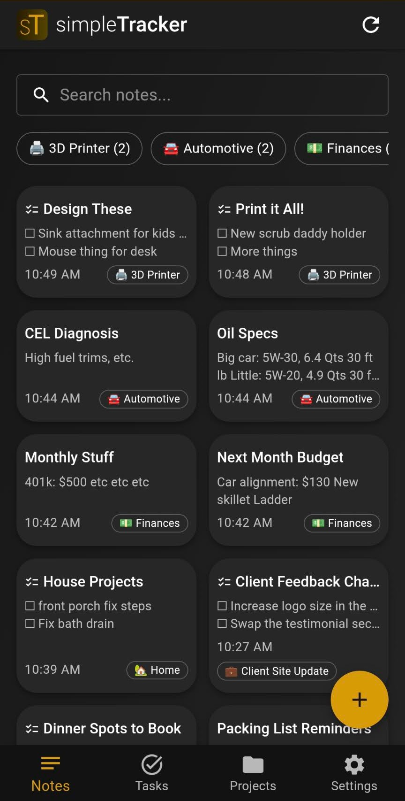 | 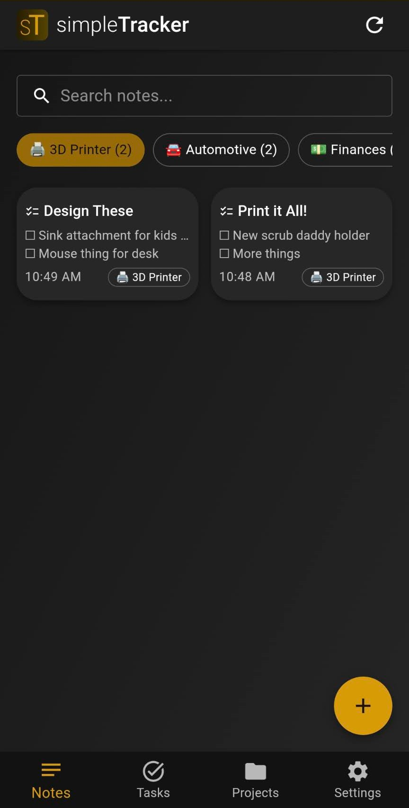 | 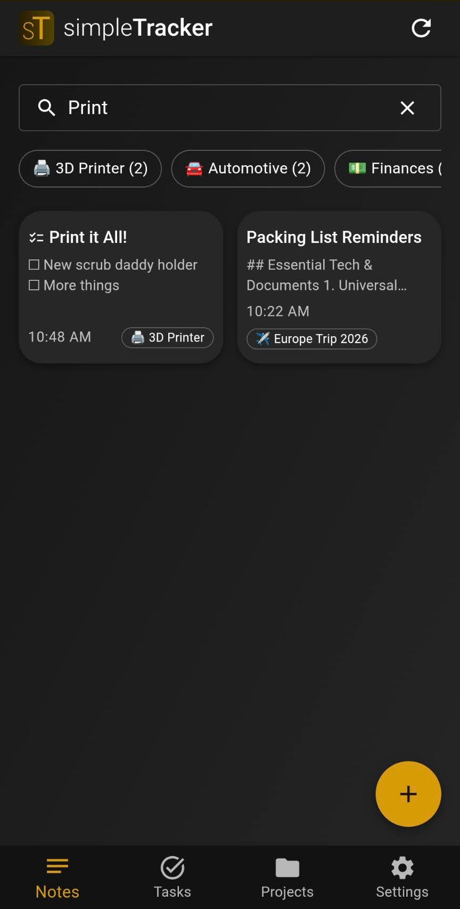 |

| Markdown editor | Checklist note |
|:-:|:-:|
| 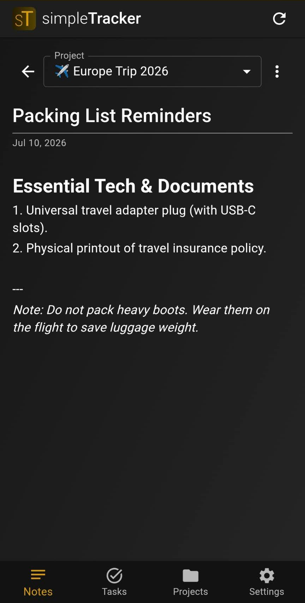 | 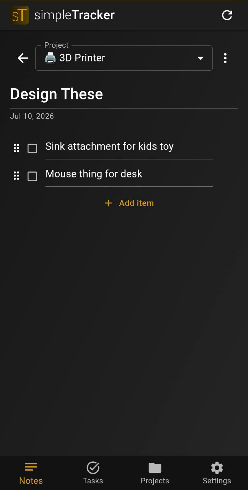 |

### Tasks

| Tasks overview | Filter by project |
|:-:|:-:|
| 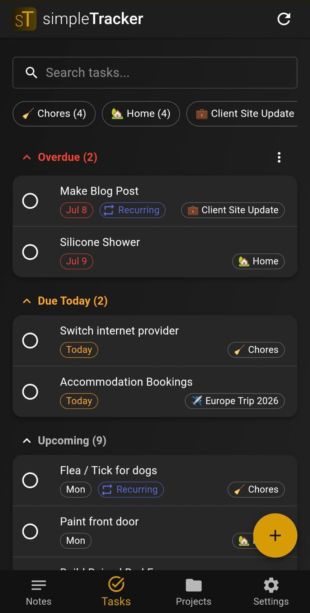 | 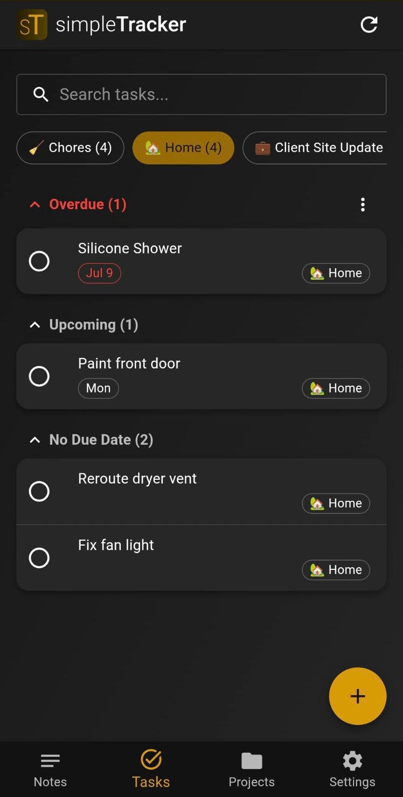 |

| Task detail | Recurring |
|:-:|:-:|
| 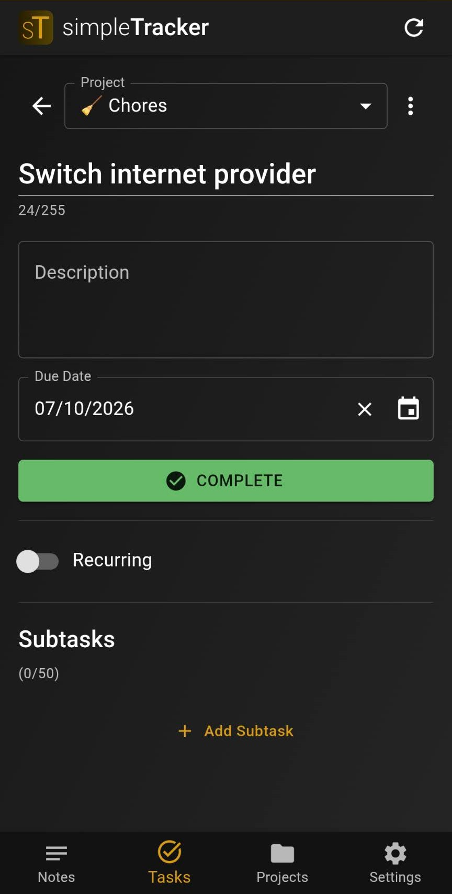 | 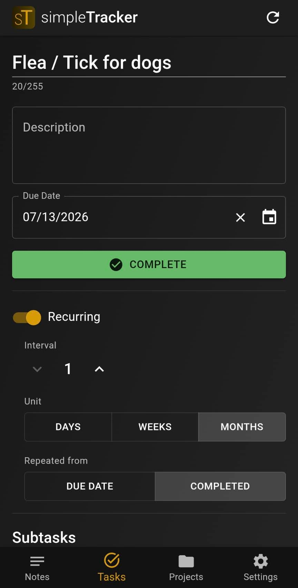 |

### Projects & Settings

| Projects overview | Project detail | Settings |
|:-:|:-:|:-:|
| 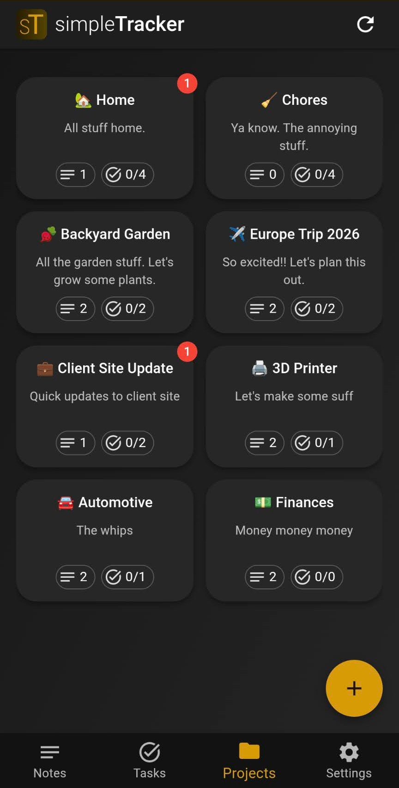 | 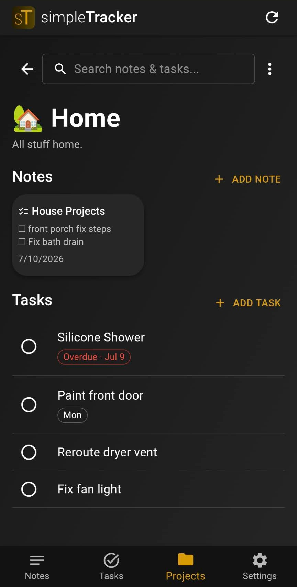 | 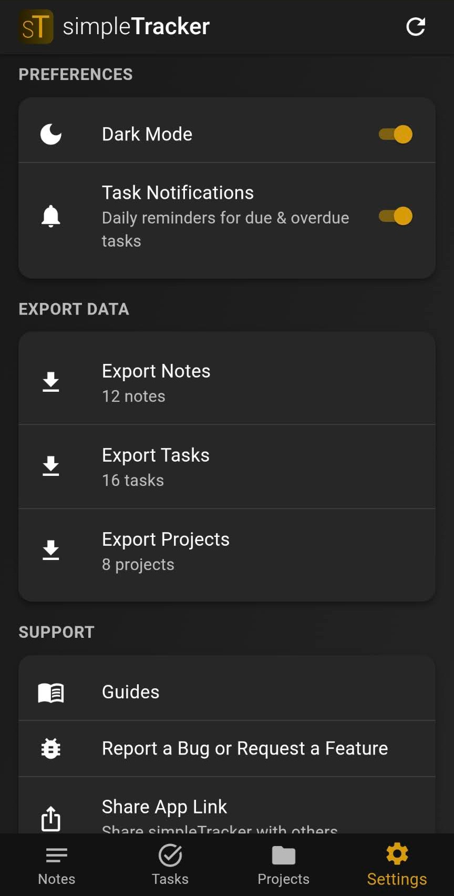 |

## An Open-Source Alternative To

- Google Keep
- Todoist
- Notion
- Apple Notes / Reminders
- TickTick
- Microsoft To Do

## Data notice

Your data is protected by RLS policies within Supabase. Only you and those you share it with can view it.

Your data will never be sold, marketed, given away, whatever. It STAYS in simpleTracker and will never leave. If you are extra concerned about data privacy / security, please self-host the backend - and the front end if you want.

## Background of this Project / Disclaimers

This has thus far been a solo project. Not gonna lie, lots of AI has gotten this project to it's feet. I used spec-driven development, not pure vibes. I have made a number of React-based projects before, and this follows all my normal guidelines. Still though, I did not write a lot of this code. Take that as you will.

I did NOT make this to make money. Hear me - I made this to have an easy to use notes/tasks app.

The subscription model is ONLY there to cover hosting fees from supabase and vercel. If you self-host the backend, everything is free - FOREVER.

I couldn't stand having an app for notes, and another app for tasks, and another app for bigger notes. That's literally what I had, lol. I also did NOT like using public apps where I didn't know what they were doing with my data (especially with Google Tasks / Keep Note - I used those heavily)

So, I took my favorite apps, smooshed them together, and only took the features I wanted. I call it simpleTracker.

From there, I went through and added some nice-to-have features.

You may notice there aren't any issues in here. Feel free to add some if you wish. I just typically keep my list elsewhere. If people start actually using this, I will transfer to issues for tracking.


## Tech Stack

| Layer | Technology |
|-------|-----------|
| Frontend | React 19, TypeScript, Vite 8 |
| UI | MUI 7 (Material UI) |
| State | Zustand 5 |
| Backend | Supabase (Auth, PostgreSQL, RLS) |
| Routing | react-router-dom v7 |
| Markdown | react-markdown + remark-gfm |
| Charts | Recharts |
| QR Codes | qrcode.react + html5-qrcode |
| PWA | vite-plugin-pwa + Workbox |
| Testing | Vitest + fast-check (property-based) |

## Getting Started

```bash
# Clone the repo
git clone https://github.com/simplesuite/simpletracker.git
cd simpletracker

# Install dependencies
npm install

# Start dev server (http://localhost:3000)
npm run dev
```

### Environment Variables

Create a `.env.local` file in the project root:

```env
VITE_SUPABASE_URL=https://your-project.supabase.co
VITE_SUPABASE_KEY=your-anon-key-here
```

If no env vars are set, the app falls back to the built-in production backend.

## Self-Hosting

To self-host simpleTracker (along with the other simpleSuite apps and the Supabase backend), see the **[simplesuite-selfhost](https://github.com/simplesuite/simplesuite-selfhost)** repository. It has everything needed to run each frontend and the backend on your own infrastructure.

simpleTracker also supports pointing at your own Supabase instance without the full selfhost setup:

1. **Global config (recommended):** Edit `public/config.js` to set `window.__SUPABASE_CONFIG__` with your Supabase URL and anon key.
2. **Per-user override:** Navigate to `/backend-config` in the app to enter a custom Supabase URL and key (stored in localStorage).
3. **Build-time env vars:** Set `VITE_SUPABASE_URL` and `VITE_SUPABASE_KEY` before building.

Priority order: config.js > localStorage override > env vars > production defaults.

## Offline Architecture

The app uses an offline-first approach for non-shared items:

- All mutations are queued in IndexedDB immediately, then synced in the background
- Cached data renders instantly on startup while fresh data loads
- Sync triggers: browser `online` event, 30-second heartbeat, app visibility change
- "Lie-fi" detection pings Supabase to verify real connectivity beyond `navigator.onLine`
- Shared items require connectivity since they involve multi-user state

## Project Structure

```
src/
├── components/
│   ├── modals/          # Dialog components
│   ├── subcomponents/   # Shared UI (AppToolbar, AreYouSure, UpdatePrompt)
│   └── extras/          # Utilities (ensureSession, OfflineAlert)
├── store/               # Zustand stores (global, notes, tasks, projects, offline, notifications)
├── lib/                 # Supabase client, cache, offline queue/sync, notifications, validation
├── types/               # TypeScript interfaces
├── App.tsx              # Root layout with bottom navigation
└── index.tsx            # Entry point, routing, SW registration
```

## Scripts

| Command | Description |
|---------|-------------|
| `npm run dev` | Start development server |
| `npm run build` | Production build |
| `npm run preview` | Preview production build locally |
| `npm test` | Run unit tests |

## Contributing

Contributions are welcome! Please open an issue or submit a pull request.

## License

This project is licensed under the [GNU AGPL v3](LICENSE).
